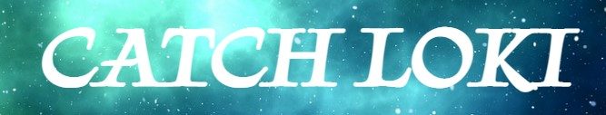
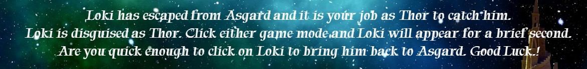
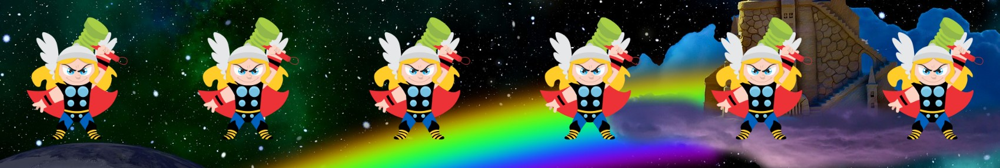
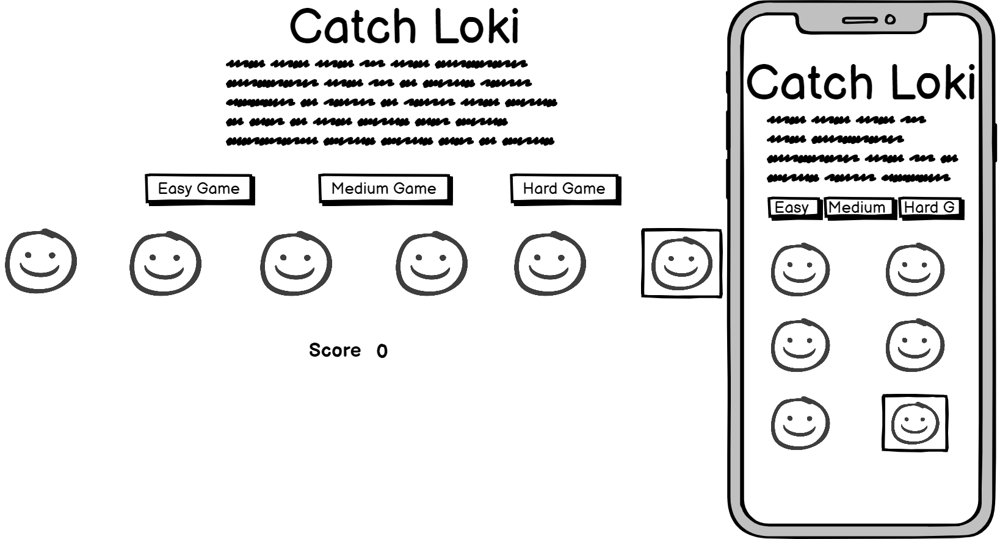
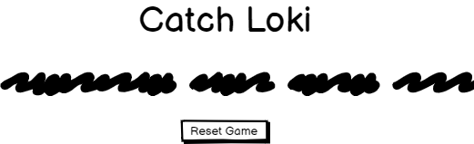
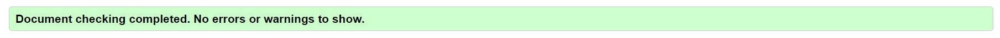
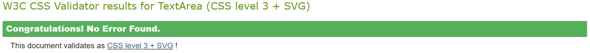

# Catch Loki
Catch Loki is a quick fire game which has 3 user levels and is based on the Norse mythology of Thor, Loki and Asgard which has been recently played out on the big screen in Marvels Thor and Avenger movies. When the user opens the initial page they are greeted with the title, the rules, 3 game levels and 6 Thor characters. The user chooses which level they want to play. When the game starts the Thor images disappear. When they reappear one of them is Loki. The user has to click on Loki before all the images disappear again.

[Link to live website] (enter here)

![Screenshot Responsive]

# Index
* User Experience
* Features
* Typography and color scheme
* Wireframes
* Technologies used
* Testing
* Bugs
* Validator testing
* Deployment
* Credits

# User Experience (UX)
### First time user goals
* As a first time user, I want to be able to easily understand how to play the game.
* As a first time user, I would like to have the game bright and welcoming.
* As a first time user, I would like to see my score and know how I did at the end of the game.
* As a first time user I would like to have the option to play different levels.
### Returning user goals
* As a returning user, I would like to be able to play a harder or easier game depending on my skill level.
### Reasons a user may visit the website
* A user is looking to play a quick game which doesn't take long.
* A user is aware of the Marvel franchise and would like to play a game which is related.
* A user would like to play a game which has various levels.
* A user would like the options of playing on phone or laptop.

# Features
## Existing Features
### Title
* Uses a well known Norse mythology and Avengers character, so the game title is instantly recognisable.

### Rules
* Tells the user how to play the game in a fun and challenging way

### Game buttons
* There are 3 game buttons giving the user the opportunity to try harder levels

### Characters
* The home screen starts with 6 Thor characters. When the game starts the characters disappear and reappear with one of them as Loki

### Score
* A score tallies up as the game is played

* A message appears depending on how the user has done

### Reset button
* Once the game has finished a reset button appears taking the user back to the home page.

### Future features
* Add more hero characters
* Incorporate sound to the game

# Typography and color scheme
* I want a font that makes the game feel a bit futuristic and 'Tapestry' works very well [Google Fonts](https://www.Fonts.google.com)
* I want a relevant background to the game so will use a cartoon interpretation of Asgard and the bi-frost which is used to travel through space from Asgard. 

# Wireframes

# Technologies used
* [HTML](https://en.wikipedia.org/wiki/HTML5) 
* [CSS](https://en.wikipedia.org/wiki/CSS)
* [Javascript](https://en.wikipedia.org/wiki/JavaScript)
### Design
* [Gitpod](https://gitpod.io)
* [Github](https://github.com/)
* [Balsamiq](https://balsamiq.com/)
* [Google Fonts](https://fonts.google.com/)
* [Font Awesome](https://fontawesome.com/)

# Testing
* I tested that this page works on Chrome, Edge and Safari.
* I confirmed that this project is responsive and works on all screen sizes using the dev tools available on Chrome and Edge.
* I confirmed that all text is readable and easy to understand.
* I confirmed that the game buttons work as they should and the levels get gradually harder.
* I have confirmed that the reset button takes the user back to the home page.

##  Testing user stories
* ##### As a first time user, I want to be able to easily understand how to play the game.
On the home page the rules of how to play are written at the top of the page under the title
* ##### As a first time user, I would like to have the game bright and welcoming.
The game has a bright cartoon element with a colorful background image
* ##### As a first time user, I would like to see my score and know how I did at the end of the game.
The game has a score tallying as the user plays. At the end of the game there a message appears telling the user whether they 'caught Loki' or not
* ##### As a first time user I would like to have the option to play different levels.
There are 3 game options; Easy; Hard; Very Hard. The levels are sequentially harder as the user goes through the levels

# Bugs
### Unsolved bugs
* The score tallies on every click meaning the user can win if they have a quick finger without clicking on 'Loki' on every turn.
### Solved Bugs
* 

# Validator Testing
### HTML
* No errors were returned when passing through the official W3C validator

### CSS
* No errors were found when passing through the official (Jigsaw) validator

### Accessibility
* I confirmed that the colours and fonts chosen are easy to read and accessible by running it through lighthouse in devtools

# Deployment
* The site was deployed to Github pages. The steps to deploy are as follows:
     * In the Github repository, navigate to the Settings tab
     * Scroll down to the Github Pages section and click on 'Check it out here!'
     * From the source section drop-down menu, select the Main Branch and click save
     * Once the Main Branch has been selected and saved the page provides the link to the completed website
     * Any changes made to the main branch and pushed to Github will take effect on the live project.

The live link can be found here [Catch Loki]()

### Cloning
* Go to https://github.com/ScotRob77/CatchLoki repsoitory on Github
* Click 'Code' which is to the left of the Gitpod button
* Copy link
* Open a Gitbash terminal and navigate to the directory where you want to locate the clone
* On the command line, type 'git clone' and paste the copied url. Press Enter to begin

# Credits
### Content
*

### Media
* Background Image by Al Seeger from [Pixabay](https://pixabay.com)
* Loki Image by Heather Ivory from [Pixabay](https://pixabay.com)
* Thor Image by Andre Santana AndreMS from [Pixabay](https://pixabay.com)