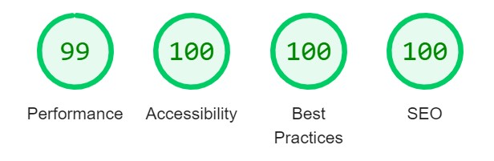

# Catch Loki
Catch Loki is a quick fire game which has 3 user levels and is based on the Norse mythology of Thor, Loki and Asgard which has been recently played out on the big screen in Marvels Thor and Avenger movies. When the user opens the initial page they are greeted with the title, the rules, 3 game levels and 6 Thor characters. The user chooses which level they want to play. When the game starts the Thor images disappear. When they reappear one of them is Loki. The user has to click on Loki before all the images disappear again. The aim is to click on Loki on each occasion that the images appear. If the user hits the Loki image every time they get a 'Congratulations' message at the end telling them they have caught Loki and they should maybe try a harder level. If they lose, the user gets a message telling them to try again. The game is a fun way of passing time and is aimed at all ages.

[Link to live website](https://scotrob77.github.io/CatchLoki/)

***

***

# Index
* [User Experience](#user-experience-ux)
* [Features](#features)
  * [Title](#title)
  * [Rules](#rules)
  * [Game Buttons](#game-buttons)
  * [Characters](#characters)
  * [Score](#score)
  * [Reset button](#reset-button)
* [Typography and color scheme](#typography-and-color-scheme)
* [Wireframes](#wireframes)
* [Technologies used](#technologies-used)
* [Testing](#testing)
  * [Testing User Stories](#testing-user-stories)
* [Bugs](#bugs)
* [Validator testing](#validator-testing)
* [Deployment](#deployment)
  * [Cloning/Forking](#cloningforking)
* [Credits](#credits)

***

# User Experience (UX)
### First time user goals
* As a first time user, I want to be able to easily understand how to play the game.
* As a first time user, I would like to have the game bright and welcoming.
* As a first time user, I would like to see my score and know how I did at the end of the game.
* As a first time user I would like to have the option to play different levels.
### Returning user goals
* As a returning user, I would like to be able to play a harder or easier game depending on my skill level.
### Reasons a user may visit the website
* A user is looking to play a quick game which doesn't take long.
* A user is aware of the Marvel franchise and would like to play a game which is related.
* A user would like to play a game which has various levels.
* A user would like the options of playing on phone or laptop.

***

# Features
## Existing Features
### Title
Uses a well known Norse mythology and Avengers character, so the game title is instantly recognisable.

### Rules
Tells the user how to play the game in a fun and challenging way

### Game buttons
There are 3 game buttons giving the user the opportunity to try harder levels

### Characters
The home screen starts with 6 Thor characters. When the game starts the characters disappear and reappear with one of them as Loki

### Score
A score tallies up as the game is played

A message appears depending on how the user has done.

### If the user has lost

### If the user has won

### Reset button
Once the game has finished a reset button appears, which when pressed, takes the user back to the home page.

### Future features
* Add more hero characters
* Incorporate sound to the game

***

# Typography and color scheme
* I want a font that makes the game feel a bit futuristic and 'Tapestry' works very well [Google Fonts](https://www.Fonts.google.com)
* I want a relevant background to the game so will use a cartoon interpretation of Asgard and the bi-frost which is used to travel through space from Asgard. 

***

# Wireframes

***

# Technologies used
* [HTML](https://en.wikipedia.org/wiki/HTML5) 
* [CSS](https://en.wikipedia.org/wiki/CSS)
* [Javascript](https://en.wikipedia.org/wiki/JavaScript)
### Design
* [Gitpod](https://gitpod.io)
* [Github](https://github.com/)
* [Balsamiq](https://balsamiq.com/)
* [Google Fonts](https://fonts.google.com/)

***

# Testing
* I tested that this page works on Chrome, Edge and Safari.
* I confirmed that this project is responsive and works on all screen sizes using the dev tools available on Chrome and Edge.
* I confirmed that all text is readable and easy to understand.

* I tested all the buttons and tiles, results below

| Test          | Action        | Expected Result  | Outcome |
| ------------- |:-------------:| ---------------:| ------: |
| Easy Game Button| Button clicked | Easy game start | PASS |
| Hard Game Button| Button clicked | Hard game start | PASS |
| Very Hard Game Button| Button clicked | Very Hard game start | PASS |
| Reset Button| Button clicked | Page resets | PASS |
| Tiles work when clicked| Tiles clicked | When Loki clicked score increments, when Thor clicked no score is noted | PASS |

##  Testing user stories
* #### As a first time user, I want to be able to easily understand how to play the game.
  * On the home page the rules of how to play are written at the top of the page under the title
* #### As a first time user, I would like to have the game bright and welcoming.
  *  The game has a bright cartoon element with a colorful background image
* #### As a first time user, I would like to see my score and know how I did at the end of the game.
  * The game has a score tallying as the user plays. At the end of the game there a message appears telling the user whether they 'caught Loki' or not
* #### As a first time user I would like to have the option to play different levels.
  * There are 3 game options; Easy; Hard; Very Hard. The levels are sequentially harder as the user goes through the them.
* #### As a returning user, I would like to be able to play a harder or easier game depending on my skill level.
  * The option to play different levels is available and a message is suggested to try a harder level if you win the game

***

# Bugs
### Unsolved bugs
* The score tallies on every click meaning the user can win if they have a quick finger without clicking on 'Loki' on every turn.
* On initial game and the first reveal of characters, the Loki character can lag with lower internet speeds.

# Validator Testing
### HTML
* No errors were returned when passing through the official W3C validator

### CSS
* No errors were found when passing through the official (Jigsaw) validator

### Javascript
* No significant issues were found when passing through [jShint](https://jshint.com/)
### Accessibility
* I confirmed that the colours and fonts chosen are easy to read and accessible by running it through lighthouse in devtools

# Deployment
This project was deployed using the steps below with version releasing active. Please do not make any changes to files within this repository as any changes pushed to the main branch will be automatically reflected on the live website. Instead please follow the second set of steps which guide you to forking and cloning the website where changes can be made without impact to the live website. Thanks!

1. Logged into [my GitHub repository](https://github.com/ScotRob77/CatchLoki)
1. Clicked on the "Settings" button in the main Repository menu.
1. Clicked "Pages" from the left hand side navigation menu.
1. Within the Source section, clicked the "Branch" button and changed from 'None' to 'Main' in the dropdown menu.
1. The page automatically refreshed with a url displayed.
1. Tested the link by clicking on the url.

The live link can be found here [Catch Loki](https://scotrob77.github.io/CatchLoki/)

## Cloning/Forking
To fork this website to either propose changes or to use as an idea for another website, follow these steps:
1. If you haven't yet, you should first set up Git. Don't forget to set up authentication to GitHub.com from Git as well.
1. Navigate to [Catch Loki](https://github.com/ScotRob77/CatchLoki).
1. Click the 'Fork' button on the upper right part fo the page. It's in between 'Watch' and 'Star'.
1. You will now have a fork of the Catch Loki repository added to your GitHub profile. Navigate to your own profile and find the forked repository to add the required files.
1. Above the list of forked files click the 'Code' button.
1. A drop-down menu will appear providing a choice of cloning options. Select the one which is applicable to your setup.
Further details on completing the final step can be found on GitHub's ['Fork a Repo'](https://docs.github.com/en/get-started/quickstart/fork-a-repo) page.

# Credits
### Content
* The idea for the game and initial coding was taken from the book [Get Coding](https://www.amazon.co.uk/Coding-Learn-JavaScript-Build-Website/dp/1406366846/ref=sr_1_1?crid=33L1I3PHDW29V&keywords=get+coding&qid=1659618829&sprefix=get+coding%2Caps%2C117&sr=8-1). 
* The Deployment and Forking text in the README was taken from [RickofManc](https://github.com/RickofManc/60-seconds-to-save-earth/blob/main/README.md?plain=1)

### Media
* Background Image by Al Seeger from [Pixabay](https://pixabay.com)
* Loki Image by Heather Ivory from [Pixabay](https://pixabay.com)
* Thor Image by Andre Santana AndreMS from [Pixabay](https://pixabay.com)
* Favicon Image generated using [Favicongenerator](https://www.favicongenerator.com/)